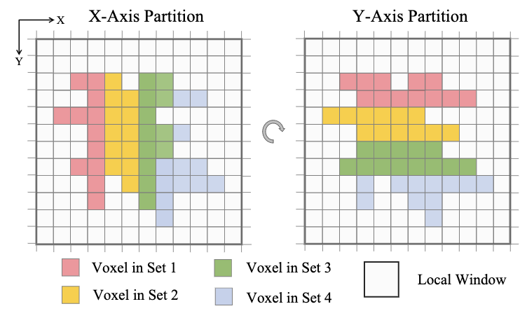
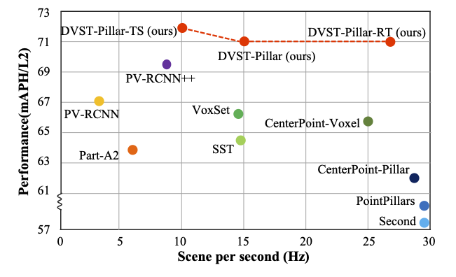

# DSVT: Dynamic Sparse Voxel Transformer with Rotated Sets
	
<!-- 

 -->

This repo is the official implementation of: [DSVT: Dynamic Sparse Voxel Transformer with Rotated Sets](www.google.com) as well as the follow-ups. Our DSVT achieves state-of-the-art performance on large-scale Waymo Open Dataset with real-time inference speed (27Hz).

## News
- [23-01-17] DSVT is released on [arXiv](www.google.com).

## Introduction
Dynamic Sparse Voxel Transformer is initially described in [arXiv](www.google.com), which is an efficient yet deployment-friendly 3D transformer backbone for outdoor 3D object detection. It partitions a series of local regions in each window according to its sparsity and then computes the features of all regions in a fully parallel manner. Moreover, to allow the cross-set connection, it designs a rotated set partitioning strategy that alternates between two partitioning configurations in consecutive self-attention layers.

DSVT achieves state-of-the-art performance on large-scale Waymo one-sweeps 3D object detection (`78.2 mAPH L1` and `72.1 mAPH L2` on one-stage setting) and (`78.9 mAPH L1` and `72.8 mAPH L2` on two-stage setting), surpassing previous models by a large margin. Moreover, as for multiple sweeps setting ( `2`, `3`, `4` sweeps settings), our model reaches `74.6 mAPH L2`, `75.0 mAPH L2` and `75.6 mAPH L2` in terms of one-stage framework and `75.1 mAPH L2`, `75.5 mAPH L2` and `76.2 mAPH L2` on two-stage framework, which outperforms the previous best multi-frame methods with a large margin. Note that our model is not specifically designed for multi-frame detection, and only takes concatenated point clouds as input.

## Main results
**We provide the pillar and voxel 3D version of one-stage DSVT. The two-stage versions with [CT3D](https://github.com/hlsheng1/CT3D) are also listed below.**
### 3D Object Detection (on Waymo validation)
#### One-Sweeps Setting
|  Model  |  #Sweeps | mAP_L1 | mAPH_L1 | mAP_L2  | mAPH_L2 | 
|---------|---------|--------|--------|---------|--------|
|  DSVT(Pillar) | 1       |  79.5  |  77.1  |  73.2   |  71.0  |
|  DSVT(Voxel) | 1       |  80.3  |  78.2  |  74.0   |  72.1  |
|  DSVT(Pillar-TS) | 1       |  80.6  |  78.2  |  74.3   |  72.1  |
|  DSVT(Voxel-TS) | 1       |  81.1  |  78.9  |  74.8   |  72.8  |

#### Multi-Sweeps Setting
##### 2-Sweeps
|  Model  |  #Sweeps | mAP_L1 | mAPH_L1 | mAP_L2  | mAPH_L2 | 
|---------|---------|--------|--------|---------|--------|
|  DSVT(Pillar) | 2       |  81.4  |  79.8  |  75.4   |  73.9  | 
|  DSVT(Voxel) | 2       |  81.9  |  80.4  |  76.0   |  74.6  | 
|  DSVT(Pillar-TS) | 2       |  81.9  |  80.4  |  76.0   |  74.5  | 
|  DSVT(Voxel-TS) | 2       |  82.3  |  80.8  |  76.6   |  75.1  | 

##### 3-Sweeps
|  Model  |  #Sweeps | mAP_L1 | mAPH_L1 | mAP_L2  | mAPH_L2 | 
|---------|---------|--------|--------|---------|--------|
|  DSVT(Pillar) | 3       |  81.9  |  80.5  |  76.2   |  74.8  | 
|  DSVT(Voxel) | 3       |  82.1  |  80.8  |  76.3   |  75.0  |  
|  DSVT(Pillar-TS) | 3       |  82.5  |  81.0  |  76.7   |  75.4  |
|  DSVT(Voxel-TS) | 3       |  82.6  |  81.2  |  76.8   |  75.5  | 

##### 4-Sweeps
|  Model  |  #Sweeps | mAP_L1 | mAPH_L1 | mAP_L2  | mAPH_L2 | 
|---------|---------|--------|--------|---------|--------|
|  DSVT(Pillar) | 4       |  82.5  |  81.0  |  76.7   |  75.3  |  
|  DSVT(Voxel) | 4       |  82.6  |  81.3  |  76.9   |  75.6  |
|  DSVT(Pillar-TS) | 4       |  82.9  |  81.5  |  77.3   |  75.9  | 
|  DSVT(Voxel-TS) | 4       |  83.1  |  81.7  |  77.5   |  76.2  |

#### Inference Speed
We present a comparison with other state-of-the-art methods on both inference speed and performance accuracy. **After being deployed by NVIDIA TensorRT, our model can achieve a real-time running speed (27Hz).** 

|  Model  |  Latency |  mAP_L2  | mAPH_L2 | 
|---------|---------|---------|--------|
|  Centerpoint-Pillar | 35ms       |  74.3   |  72.1  |
|  Centerpoint-Voxel | 40ms       |  76.0   |  74.5  |
|  PV-RCNN++(center) | 113ms       |  76.7   |  75.4  |
|  DSVT(Pillar) | 67ms       |  77.3   |  75.9  |  
|  DSVT(Voxel) | 97ms       |  74.8   |  72.8  |
|  DSVT(Pillar+TensorRt) | 37ms       |  76.6   |  75.1  |  

## Citation
Please consider citing our work as follows if it is helpful.

## Acknowledgments
This project is based on the following codebases.
* [OpenPCDet](https://github.com/open-mmlab/OpenPCDet)
* [SST3D](https://github.com/tusen-ai/SST)